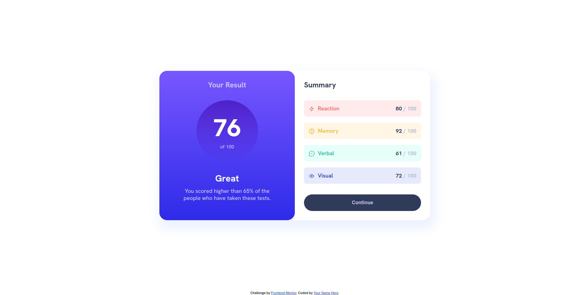

# Frontend Mentor - Results summary component solution

This is a solution to the [Results summary component challenge on Frontend Mentor](https://www.frontendmentor.io/challenges/results-summary-component-CE_K6s0maV). Frontend Mentor challenges help you improve your coding skills by building realistic projects.

## Table of contents

- [Overview](#overview)
  - [The challenge](#the-challenge)
  - [Screenshot](#screenshot)
  - [Links](#links)
- [My process](#my-process)
  - [Built with](#built-with)
  - [What I learned](#what-i-learned)
  - [Continued development](#continued-development)
  - [Useful resources](#useful-resources)
- [Author](#author)

## Overview

### The challenge

Users should be able to:

- View the optimal layout for the interface depending on their device's screen size
- See hover and focus states for all interactive elements on the page

### Screenshot

### Links

- Solution URL: [https://www.frontendmentor.io/solutions/resultssummarycomponent-YVaw5XquBr](https://www.frontendmentor.io/solutions/resultssummarycomponent-YVaw5XquBr)
- Live Site URL: [https://eloquent-moonbeam-8f271e.netlify.app](https://eloquent-moonbeam-8f271e.netlify.app)

## My process

### Built with

- Semantic HTML5 markup
- CSS custom properties
- Flexbox
- Mobile-first workflow

### What I learned

i learned to use gradients, boxshadows

### Continued development

Im working around how to master css borders in general especially partial borders.

### Useful resources

- [https://box-shadow.dev/](https://box-shadow.dev/) - This helped me to create boxshadows easily.

## Author

- Frontend Mentor - [@Allanlcomander](https://www.frontendmentor.io/profile/Allanlcomander)
